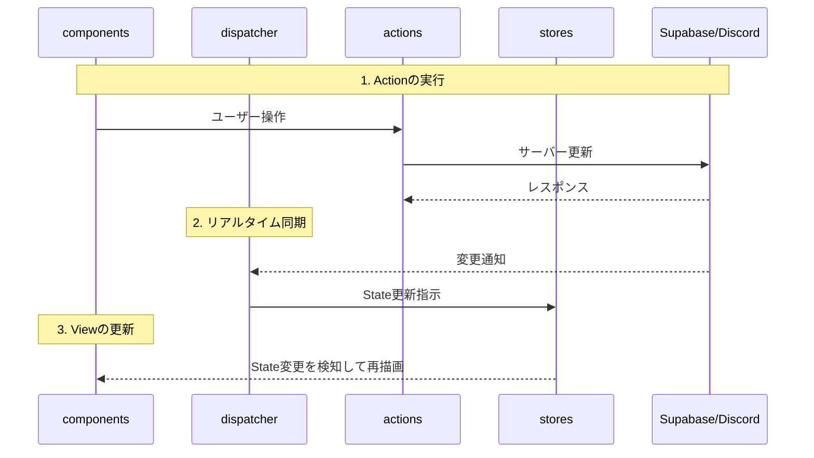

# Metacord (仮)

Discordの音声/テキストチャンネルと連動し、参加者が同一の仮想空間（2Dドット絵の部屋）に集まっているかのような体験を提供するWebアプリケーションです。

## 技術スタック
- **Frontend**: Next.js (App Router), React, Tailwind CSS, TypeScript
- **Graphics**: PixiJS (`pixi.js`, `@pixi/react`)
- **State Management**: Zustand
- **Backend / Realtime**: Supabase (`@supabase/supabase-js`)

## ディレクトリ構成

```text
metacord/
├── .github/workflows/ # CI/CD (GitHub Actions)
├── src/
│   ├── app/           # 画面（Entry Points）
│   ├── actions/       # アクション（APIリクエスト、保存ロジック等）
│   ├── components/    # すべてのUIコンポーネント（View）
│   ├── dispatcher/    # 同期・購読などのオーケストレーター
│   ├── stores/        # 状態定義（Zustand）
│   ├── constants/     # マスターデータ・定数
│   ├── utils/         # 汎用ユーティリティ・インフラ設定
│   └── types/         # 型定義
├── supabase/          # Migrations & CLI Config
├── document/          # Design Docs
└── public/            # Static Assets
```

## アーキテクチャ (Flux基準)

本プロジェクトでは、役割ごとにディレクトリを分離した Flux 構造を採用しています。

### フォルダの役割

- **`actions/`**: ユーザー操作に端を発する処理（DB保存、外部APIコールなど）を記述。
- **`components/`**: React/PixiJS のコンポーネント。表示に専念。
- **`dispatcher/`**: Supabase Realtime の購読など、複数の Store や Action を跨ぐ連続的な処理を制御。
- **`stores/`**: `Zustand` を用いたアプリケーションのグローバル状態管理。
- **`constants/`**: アバターの一覧定義など、アプリケーション全体で不変の静的データ。
- **`utils/`**: Supabase クライアントや共通の計算ロジックなどの汎用ツール。

### データの流れ



---

## 開発環境のセットアップ

### 1. 準備
```bash
npm install
npx supabase login
```

### 2. 環境変数の設定
`.env.local` を作成し、開発用 Supabase の情報を設定します。
```bash
NEXT_PUBLIC_SUPABASE_URL=https://your-dev-project.supabase.co
NEXT_PUBLIC_SUPABASE_ANON_KEY=your-dev-anon-key
```

### 3. プロジェクトのリンクと起動
```bash
npx supabase link --project-ref [開発用プロジェクトID]
npm run dev
```

---

## デプロイと環境構成

本プロジェクトはブランチごとに環境が分離されています。

| 環境 | ブランチ | デプロイ先 | 説明 |
| :--- | :--- | :--- | :--- |
| **Local** | - | localhost:3000 | 開発用 Supabase に接続 |
| **Dev** | `dev` | Vercel (Preview) | 開発中のプレビュー環境 |
| **Prod** | `main` | Vercel (Production) | 本番環境。自動で DB マイグレーションも適用されます |

### Supabase 情報の確認方法
- **Project ID**: Settings > General > Reference ID
- **DB Password**: プロジェクト作成時のパスワード（忘れた場合は Settings > Database でリセット可）

---

## 開発・運用フロー（DB変更）

データベースの構造を変更（テーブル追加など）する際の手順です。

1. **マイグレーションの作成**
   `npx supabase migration new [name]`
2. **SQLの記述**
   `supabase/migrations/` 配下のファイルに SQL を書く。
3. **マージ・自動適用**
   `main` ブランチにマージすると、GitHub Actions が本番環境へ自動反映します。

> [!TIP]
> 既存の開発プロジェクトで **401 Unauthorized** が発生している場合は、`document/fix_401_rls.sql` を開発環境の SQL Editor で一度実行してください。

---

## 環境の複製（追加環境の作成）

別プロジェクトへ現在の設計を反映させる手順：
1. `npx supabase link --project-ref [新しいID]` でリンク。
2. `npx supabase db push --password [DBパスワード]` で反映。
